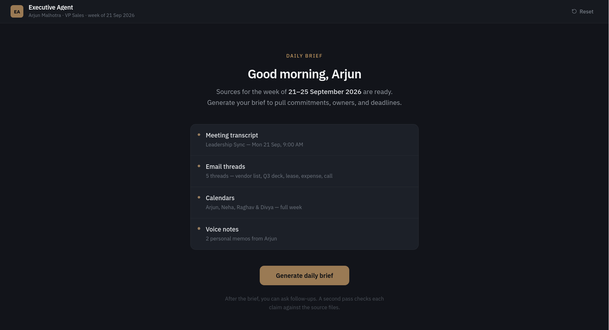
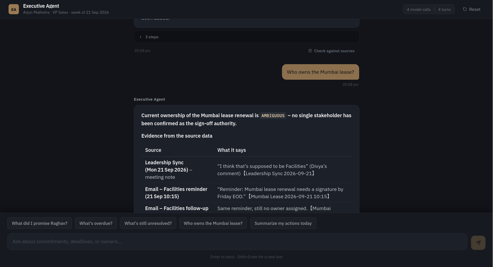

# Executive Productivity Agent

> **Assignment 1 — AIONOS AI Factory**  
> Built for Arjun Malhotra, VP Sales at Veridian Corp. Week of 21–25 September 2026.

**🔗 Live demo → [executive-productivity-agent-h74i.onrender.com](https://executive-productivity-agent-h74i.onrender.com)**  
**📁 Source → [github.com/harshitj183/executive-productivity-agent](https://github.com/harshitj183/executive-productivity-agent)**

---

## Overview

An AI agent that reads Arjun's meeting transcript, email threads, calendar, and personal voice notes — then extracts every commitment, classifies ownership, tracks deadlines, and generates a structured daily brief. A second validator agent cross-checks every claim against the raw source data.

---

## Screenshots

### 1 — Welcome screen

Sources are listed before the agent runs. Every claim the agent makes will trace back to one of these four sources.



---

### 2 — Agent reasoning trace (live tool calls)

While generating the brief, the agent calls its tools in real time — searching emails, fetching thread histories, checking deadlines. Every step is visible and inspectable.


---

### 3 — Follow-up Q&A with source attribution

Ask "Who owns the Mumbai lease?" and the agent returns a structured answer with a full evidence table — each source cited by date, sender, and exact quote. No guessing, no inventing.



---

## What the two agents do

**Main agent**
- Reads all four source types: meeting transcript, 5 email threads (25 emails), 4 calendars, 2 voice notes
- Classifies every item: **MY_ACTION** / **WAITING_ON_OTHERS** / **AMBIGUOUS**
- Deduplicates — the vendor list deadline shifted Mon → Tue → Wed across 5 emails; the brief shows only the final deadline and notes the history
- Cites the exact source(s) for every commitment
- Maintains conversation memory so follow-up questions work without re-explaining context

**Validator agent**
- Single-pass fact-check on any response
- Checks every claim against the raw source data
- Returns **PASS / PARTIAL / FAIL** with specific issues cited

---

## Quick start

```bash
git clone https://github.com/harshitj183/executive-productivity-agent.git
cd executive-productivity-agent

# Add your Groq API key
echo "GROQ_API_KEY=your_key_here" > backend/.env

./start.sh
# → http://localhost:5173
```

Requirements: Python 3.9+, Node 18+

---

## Tech stack

| Layer | Technology |
|-------|-----------|
| LLM | Groq API — `openai/gpt-oss-120b` with automatic fallback to `gpt-oss-20b` → `qwen/qwen3.8-27b` |
| Backend | Python 3.12, FastAPI, Uvicorn |
| Agentic loop | Native Groq function calling, source data embedded in context |
| Frontend | React 18, TypeScript, Vite, Tailwind CSS, IBM Plex fonts |
| Streaming | Server-Sent Events — reasoning trace streams in real time |
| Tests | pytest — 30 tests, 100% pass |
| Deploy | Render (free tier, auto-deploy from GitHub) |

---

## Agent tools (7 total)

| Tool | Purpose |
|------|---------|
| `search_emails` | Full-text search across all 5 email threads |
| `search_voice_notes` | Search Arjun's personal voice memos |
| `search_meeting_transcript` | Search the Leadership Sync transcript |
| `get_calendar_events` | Calendar for any person, optionally filtered by date |
| `calculate_deadline_urgency` | Date → OVERDUE / DUE TODAY / "Due in N days" |
| `get_person_info` | Name, role, email of any stakeholder |
| `get_thread_history` | Full chronological thread — critical for tracking deadline shifts |

---

## Tests

```bash
cd backend
python3 -m pytest tests/ -v
# 30 passed
```

Covers: deadline urgency calculation, email/transcript/voice search accuracy, calendar retrieval, thread history (dedup), person lookup.

---

## Key design decisions

**Source data always in context** — The full source text is embedded in the agent's first message. Tools are supplementary. The agent cannot "not have" the data.

**Model fallback chain** — Primary `gpt-oss-120b` → `gpt-oss-20b` → `qwen/qwen3.8-27b`. Rate limit on one model = automatic switch to the next.

**No hallucination policy** — System prompt forbids inventing facts. Mumbai lease is flagged AMBIGUOUS because no source confirms who signs it. No guessing.

**Dedup by thread history** — `get_thread_history` returns full chronological thread so the agent can see the vendor list deadline moved Monday → Tuesday → Wednesday and surfaces only the final version.

**Cost control** — Source context injected once per session. Tool results capped at 600 chars. Max 3 agentic iterations before forcing final answer.

---

## Project structure

```
executive-agent/
├── backend/
│   ├── app/
│   │   ├── agents/
│   │   │   ├── main_agent.py       # Agentic loop + source embedding + model fallback
│   │   │   ├── validator_agent.py  # Fact-checking agent
│   │   │   └── tools.py            # 7 callable tools
│   │   ├── api/routes.py           # FastAPI routes (SSE streaming)
│   │   ├── core/session.py         # Global session management
│   │   ├── data/source_data.py     # All embedded source data
│   │   └── main.py                 # App entrypoint + serves React frontend
│   ├── tests/test_tools.py         # 30 pytest tests
│   └── requirements.txt
├── frontend/src/
│   ├── components/                 # Header, WelcomeScreen, MessageBubble, etc.
│   ├── App.tsx
│   └── api.ts                      # SSE client with AbortController (stop button)
├── docs/
│   ├── screenshots/                # Demo screenshots
│   ├── architecture.md             # Full system diagram
│   ├── prd.md                      # Product requirements
│   └── demo-script.md              # Step-by-step demo walkthrough
├── render.yaml                     # Render deployment config
├── start.sh                        # One-command local startup
└── README.md
```
